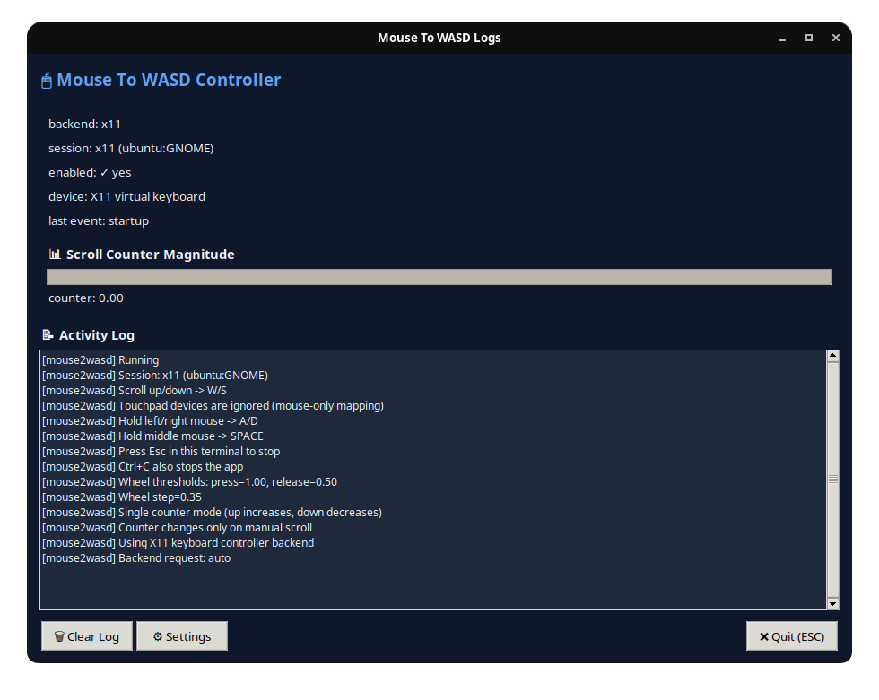
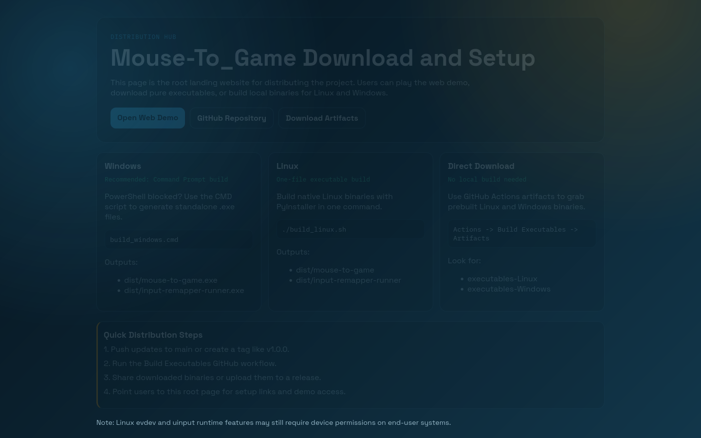
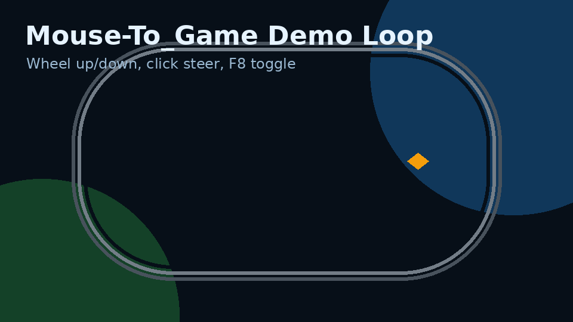

# Mouse-To_Game

<p align="center">
  
</p>

<p align="center">
  
  
  
</p>

This project is primarily a desktop mouse-to-key mapper for real games.
The browser game is optional and only used as a quick test/demo environment.

## Tool First Showcase

### Desktop Tool UI


### Real Project Landing



### Demo Media



<video src="assets/readme/demo.mp4" controls muted loop width="100%"></video>

## What The Tool Does

- Maps mouse wheel and clicks to configurable keys.
- Works with multiple backends: auto, evdev, x11, pynput.
- Supports live key remapping from the GUI.
- Includes emergency stop and quick enable/disable flow.
- Provides executable builds for Linux and Windows.

## Quick Start (Tool)

### Run From Source

```bash
python3 -m pip install -r requirements.txt
python3 mouse_to_wasd.py
```

Debug mode:

```bash
python3 mouse_to_wasd.py --debug
```

Common key-mapping override:

```bash
python3 mouse_to_wasd.py --key-forward up --key-backward down --key-left left --key-right right
```

Wheel tuning:

```bash
python3 mouse_to_wasd.py --wheel-step 0.35 --wheel-press-threshold 1.0 --wheel-release-threshold 0.5
```

### Tool Controls

- Wheel up: increase forward charge
- Wheel down: increase backward charge
- Left mouse hold: left key
- Right mouse hold: right key
- Middle mouse hold: jump/action key
- F8: enable/disable mapper
- Esc: stop app in terminal

## Executable Distribution

### Linux Build

```bash
./build_linux.sh
```

Outputs:

- dist/mouse-to-game
- dist/input-remapper-runner

### Windows Build (Command Prompt)

```cmd
build_windows.cmd
```

PowerShell alternative:

```powershell
./build_windows.ps1
```

Outputs:

- dist/mouse-to-game.exe
- dist/input-remapper-runner.exe

## Input Remapper Runner Helper

Run with explicit values:

```bash
python3 input_remapper_runner.py --device "BT5.4 Mouse" --preset "The Gaming Setup"
```

List device keys:

```bash
input-remapper-control --list-devices
```

Runner behavior:

- Interactive device picker if device is omitted.
- Preset prompt if preset is omitted.
- Touchpad-like device safeguard by default.
- Esc or Ctrl+C to stop.

## Releases and CI

Workflow: .github/workflows/build-executables.yml

- Manual run: uploads workflow artifacts.
- Tag push (v\*): creates/updates GitHub Release and uploads binaries.

Release command:

```bash
git tag v1.0.0
git push origin v1.0.0
```

## Optional: Web Demo

The web game exists only to preview feel before using the desktop mapper.

Open game/index.html in a browser.

If needed, serve locally:

```bash
python3 -m http.server 8000
```

Then open:

http://localhost:8000/game/
